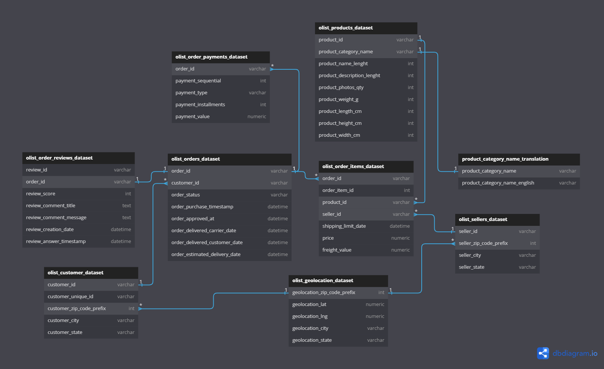
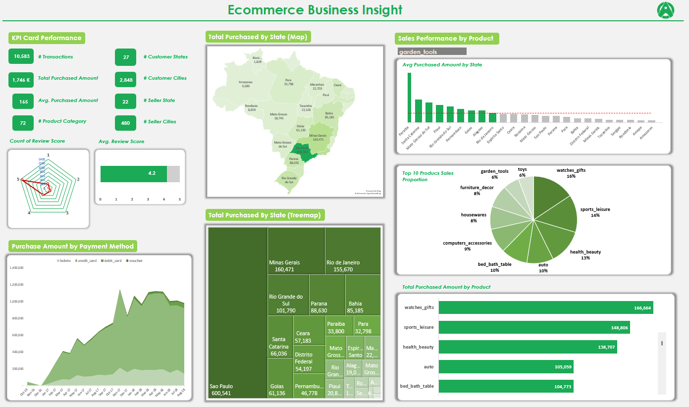
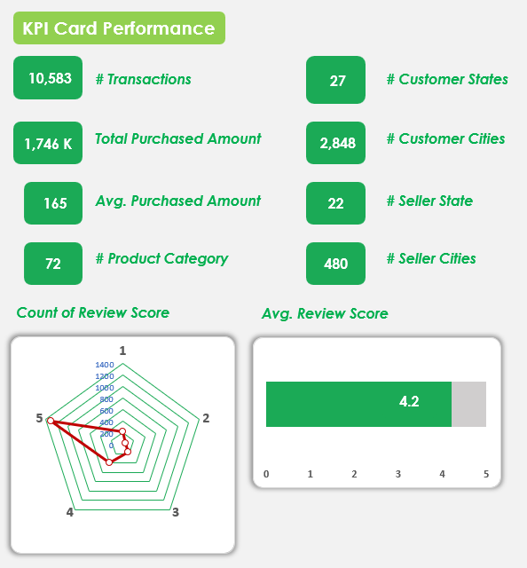
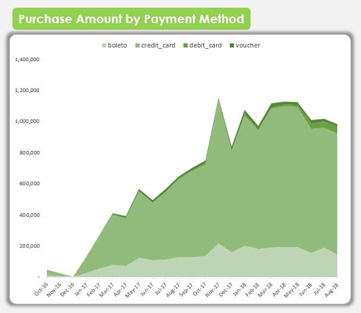
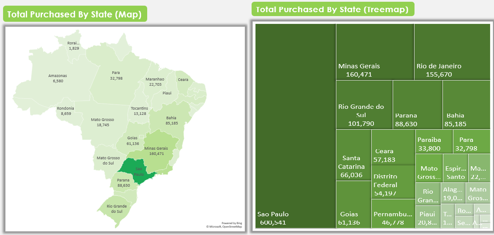
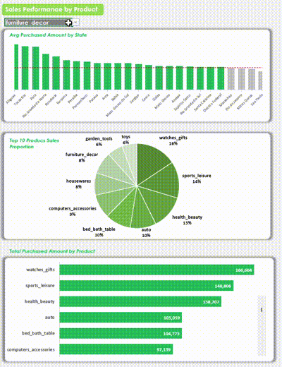

# ecommerce-business-insight-dashboard

This project objective is to gain some insights of ecommerce dataset and utilize excel's features to build an interactive and dynamic dashboard.

# 1. Dataset
The original source dataset is public datasets from Kaggle. It is based on transactions data made at Olist Store, A Brazilian ecommerce, at period **15 October 2016 - 31 August 2018** (around two years). Olist is the largest department store in Brazilian marketplace, therefore the dataset comes with transactions of various type of product categories that include up to 71 types.

Many information and insight we can gain based on the data,such as but not limited to:
- transaction by customers' location like state or city
- transaction by seller's location like state or city
- transaction by product category
- transaction by payments methods
- trend usage of payments methods
- freight performance analysis
- customer review analysis
- customer purchase behavior analysis

Here is the source link: [clik here](https://www.kaggle.com/datasets/olistbr/brazilian-ecommerce).

File or tables in the datasets are following:
1. olist_customer_dataset.csv
2. olist_geolocation_dataset.csv
3. olist_order_items_dataset.csv
4. olist_order_payments_dataset.csv
5. olist_order_reviews_dataset.csv
6. olist_orders_dataset.csv
7. olist_products_dataset.csv
8. olist_sellers_dataset.csv
9. product_category_name_translation.csv

And here is the ERD based on the original source:

## Business Context
This dataset was generously provided by Olist, the largest department store in Brazilian marketplaces. Olist connects small businesses from all over Brazil to channels without hassle and with a single contract. Those merchants are able to sell their products through the Olist Store and ship them directly to the customers using Olist logistics partners.

After a customer purchases the product from Olist Store a seller gets notified to fulfill that order. Once the customer receives the product, or the estimated delivery date is due, the customer gets a satisfaction survey by email where he can give a note for the purchase experience and write down some comments.

# 2. Methods and Processes
Since the dataset is consist of several files or tables, it is good to denormalize it so that make it in more simple by focusing to only few new tables used to build the interactive dashboard.

In the project, we created four denormalized tables:
1. orders

The core transaction data merged with many original tables related to customer, seller, the locations (state and city), product, purchase date, purchase amount, freight amount, total transaction amount.

2. order_payments

Basically a merged table between **olist_orders and olist_payments tables**.

To simplify the analysis and visualization process related to *transactions by payment method*.

3. order_reviews

Essentially a merged table between **olist_orders and olist_order_reviews tables**.

To simplify the analysis and visualization process related to *customer reviews and the scores*.

4. order_states

It is a transformed tables which originally from **olist_orders table**.

It is to simplify the analysis and visualization process related to *transactions by state location*.

Besides, we added some new columns to make the development easier:
- translated version of **product_category** (in English) in orders table
- **order_purchase_month** in order_payments table
- states and cities location using their full name instead of codes in order_reviews, order_states, and orders tables

All the rest is using features of excel to build the visualization and interactivity. Last but not least arranged the layout well to build a dashboard which is tidy, compact, and pleasing to the eye.

# 3. Result Previews and Insights
## 3.1. Overview

The figure above is the dashboard.

It comprises some sections based on insight context. They are as follows:
1. Card Metrics
2. Transactions by Payment Method
3. Transactions by State (in maps)
4. Transactions by Product Category

All of them will be discussed in the following sections.

## 3.2. Card Metrics

This part, give insight about high-level business metrics.

It tells about:
1. total number of transaction
2. total purchased amount
3. average purchased amount per transaction
4. number of product category
5. number of customer states
6. number of customer cities
7. number of seller states
8. number of seller cities
9. customer review overall and average numbers

 
Using some common knowledges, here are how to interpret the numbers in this section:
- *the higher total transaction or average transaction amount the better*

It indicates the increase revenue obtained. It is the most important metric of a business afterall.

- *the more varied the customers or seller location (state or city) the better*

It indicates that the business has positive growth in terms of market reach. It can also interpreted as the growth of business resilience. 

- *the more varied the product category the better*

It indicates that the business has increase of sales opportunity, especially if combined using strategy of cross-selling or upselling.

In addition is also means the increase in customer attraction of broader customer types.

- *the higher the customer review score the better*

It indicates of the higher customer satisfaction level. 

Based on the data, average review score is 4.2 out of 5. That means there is still plenty of room for growth.

## 3.3. Payment Method

The figure above, tells some insights:
- the most commonly used payment method is *boleto* and *credit card*. Both significantly dominated over the other two: debit card and voucher.
- There is positive trend regarding total purchase amount over the time from 2016 to 2018. This indicates that company has positive growth. 

## 3.4. Transactions in Maps

- 
The map and treemap chart show visualization of total transaction amount by states location of customers.

The darker the color, the higher the transaction amount in that state and vice versa.

Both combined yield interesting insights. Those are:
- *Sao Paulo* dominating the contribute by around 30% of total transaction amount in Olist.
- Overall, the most contributing states are in around Eastern and Southern Brazil such as: *Sao Paulo, Minas Gerais, Rio Grande do Sul, Rio de Janeiro, Parana, and Bahia*. This indicates, there is high demand and high purchasing power in Eastern and Southern Brazil. Whereas in the Northern Brazil that that is not the case since the total transaction amount is much smaller.

## 3.5. Transactions by Product Category

In this section, there are some interactive features to gain insights dynamically to help decide the suitable business strategy related to transaction by product category.

The top 10 most purchased product categories as below:
1. Watches gifts
2. Sports leisure
3. Health beauty
4. Auto
5. Bed bath table
6. Computers accessories
7. Housewares
8. Furniture decor
9. Garden tools
10. Toys

The topmost chart also can help to monitor based on product category filter which states have the average transaction amount higher than the overall average amount (green-colored bar) and which states which have not (grey-colored bar). Of course, this feature can help in several business strategy approaches such as marketing campaigns for vouchers or promotions for certain products in specific states.